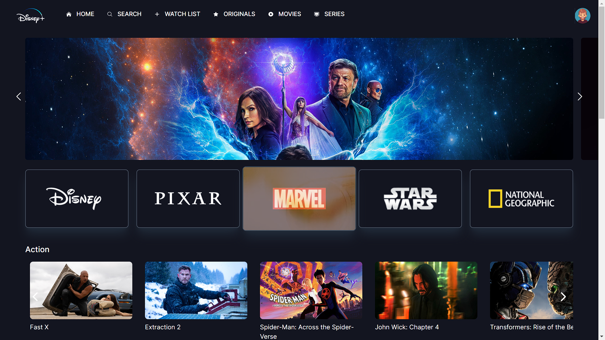

# Disney+ Clone

This project is a Disney+ clone built using React and Vite.js, and it leverages the IMDB Movies Database API to fetch movie information. The clone aims to replicate the popular Disney+ streaming platform's user interface and functionality.



## Features

- Browse and search for movies available in the IMDB Movies Database.
- View detailed information about each movie, including the title, release date, rating, and overview.
- Play movie trailers directly within the application.
- Responsive design for seamless browsing on different device

## Demo Deploys on netlify

A live demo of the Disney+ Clone can be accessed [here](https://rad-youtiao-402d92.netlify.app/).

## Installation

1. Clone the repository:

```bash
git clone https://github.com/sourabhvv/Disney-front-end.git
```

2. Navigate to the project directory:

```bash
cd disney-plus-clone
```

3. Install the dependencies:

```bash
npm install
```

4. Obtain an API key from the IMDB Movies Database API. Rename the `.env.example` file to `.env` and replace `YOUR_API_KEY` with your actual API key.

5. Start the development server:

```bash
npm run dev
```

6. Open your web browser and visit `http://localhost:3000` to see the application in action.

## Technologies Used

- React - JavaScript library for building user interfaces.
- Vite.js - A fast build tool and development server for modern web applications.
- IMDB Movies Database API - Provides movie data and information.

## Project Structure

```plaintext
├── public/                # Public assets and index.html
├── src/                   # Source code
│   ├── components/        # Reusable components
│   ├── pages/             # Individual pages/routes
│   ├── services/          # API services and utility functions
│   ├── styles/            # Global styles and CSS modules
│   ├── App.jsx            # Root component
│   └── index.jsx          # Entry point
└── package.json           # Project dependencies and scripts
```

## Contributing

Contributions are welcome! If you find any issues or want to enhance the project, feel free to open an issue or submit a pull request. Make sure to follow the existing coding style and conventions.

## thanks to TubeGuruji for this amazing tutorial 
check here- https://youtu.be/3NHYl0Lo74A

## Acknowledgments

- [IMDB Movies Database API]for providing movie data.
- The Disney+ streaming platform for the inspiration behind this clone.

## Contact
sourabhv945@gmail.com

For any questions or inquiries, please reach out to [your-email@example.com](mailto:your-email@example.com).

---
Please replace `your-username`, `your-demo-link.com`, `YOUR_API_KEY`, `your-api-link.com`, and `your-email@example.com` with the appropriate values for your project.
